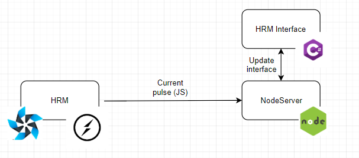

# PulseHandler

PulseHandler consists of 3 modules:
* HRM - application for Tizen OS showing current heart rate on watch. Can be built in Tizen Studio.
* HRMInterface - application for Windows OS reading current heart rate from file and displaying it. Can be built in Visual Studio.
* NodeServer - server scipt that accept data using WebSocketServer.
* _extra is for scripts and projects that can be usable in this system

